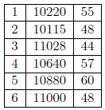
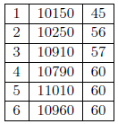

# Gossip Style Failure Detection

### Suppose a distributed system is running a gossip-style failure detection with Tfail = 15; Tcleanup = 20. If a node A, at local time = 65, has heartbeat table

### and receives a gossip message from node B containing the table

### What will the updates table of A look like?
